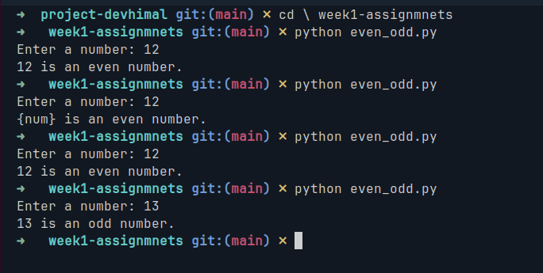
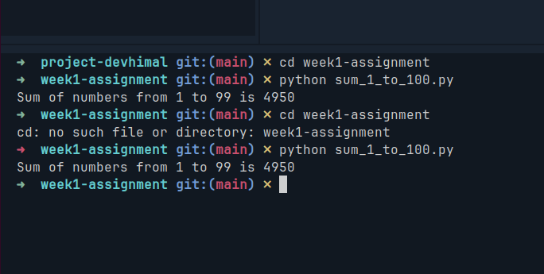
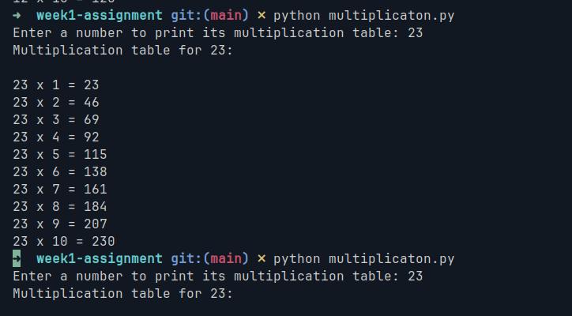
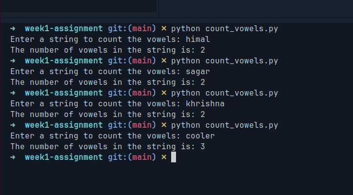

## Assignment Questions

1. Write a program that checks whether a number entered by the user is even or odd.

#### Screenshot

2. Use a for loop to find the sum of numbers from 1 to 100.

#### Screenshot

3. Ask the user to input a number and print its multiplication table from 1 to 10.

#### Screenshot

4. Write a program to count how many vowels are in a string entered by the user.

#### Screenshot

5. Given a list of numbers, write a program to find and print the maximum number.
6. Take a string input from the user and print the reversed string.
7. Write a program to check if a number entered by the user is a prime number or not.
8. Create a list that contains the squares of numbers from 1 to 10 using a for loop.
9. Given a list of integers, count how many are even and how many are odd.
